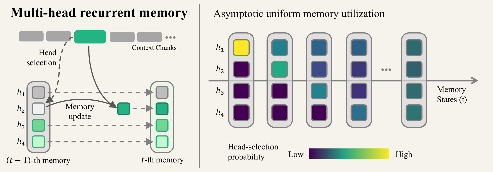
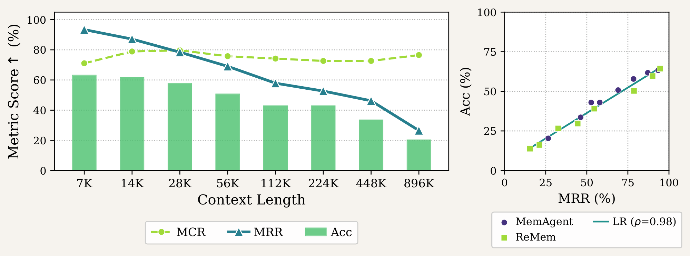
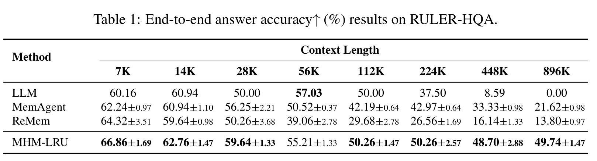
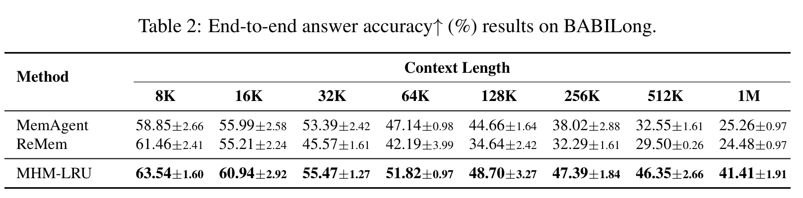

<p align="center">
  
</p>

<h1 align="center">Multi-Head Recurrent Memory Agents</h1>

<p align="center">
  <strong>Jiatong Li · Samuel Yeh · Sharon Li</strong><br>
  Department of Computer Science, University of Wisconsin-Madison
</p>

<p align="center">
  <a href="https://arxiv.org/abs/2607.01523"></a>
  <a href="https://multihead-recurrent-memory.github.io/"></a>
</p>

This repository will host the implementation of **Multi-Head Recurrent Memory (MHM)**.

## 🔍 Introduction

Recurrent memory agents process long contexts in chunks, consolidating useful information into a fixed-size memory. However, repeatedly rewriting a single memory block can erase information captured earlier, causing answer accuracy to decline as contexts grow. The paper separates memory capture from memory retention and identifies retention as the dominant bottleneck in the diagnostic experiments.

<p align="center">
  
</p>

**Diagnosing the bottleneck.** The paper separates whether answer information is ever captured from whether it survives to the final memory. On RULER-HQA, retention degrades sharply as context length grows and is strongly correlated with end-to-end accuracy.

MHM is a training-free framework that partitions memory into independent heads and selectively updates one head at a time. This simple architectural change improves information retention and long-context reasoning without requiring model training.

## ⚙️ Methodology

MHM follows a stage-wise **select-then-update** procedure:

1. **Partition memory:** Represent the memory as multiple independent text blocks, or heads.
2. **Select one head:** Choose the head to update before generating its new contents.
3. **Read all heads, write to one:** Give the model the full memory, current input chunk, and query, then replace only the selected head. All other heads remain unchanged at that step.

The lightweight **MHM-LRU** instantiation selects the least recently updated head. This distributes updates uniformly across heads and requires no additional LLM call or tokens for head selection. Unselected heads are protected from overwriting at each step; information retention is not guaranteed indefinitely.

## 📊 Main Results

The main comparisons use **Qwen2.5-14B-Instruct**, 5,000-token input chunks, and an equal total memory budget of **4,096 tokens**. MHM-LRU uses four heads of 1,024 tokens each. End-to-end answer accuracy is reported as mean ± standard deviation over three independent runs.

**RULER-HQA — end-to-end answer accuracy**



**BABILong — end-to-end answer accuracy**



- **Stronger retention:** On RULER-HQA at 896K tokens, MHM-LRU achieves **73.96% memory retention**, compared with less than 30% for both baselines. Retention measures whether captured answer information survives to the final memory; it is distinct from final-answer accuracy.
- **Higher long-context accuracy:** MHM-LRU improves accuracy over MemAgent by **28.12 percentage points** on RULER-HQA at 896K tokens and **16.15 percentage points** on BABILong at 1M tokens.
- **Generalization:** The paper also reports retention improvements with Qwen2.5-32B-Instruct and gpt-oss-120b, as well as accuracy gains over MemAgent across all ten BABILong task types at 1M tokens.

## 💻 Code Release

**Code coming soon.** Implementation and usage instructions will be added when the code is released.

## 📚 Citation

If you find this work useful, please cite:

```bibtex
@article{li2026multi,
  title={Multi-Head Recurrent Memory Agents},
  author={Li, Jiatong and Yeh, Samuel and Li, Sharon},
  journal={arXiv preprint arXiv:2607.01523},
  year={2026}
}
```
